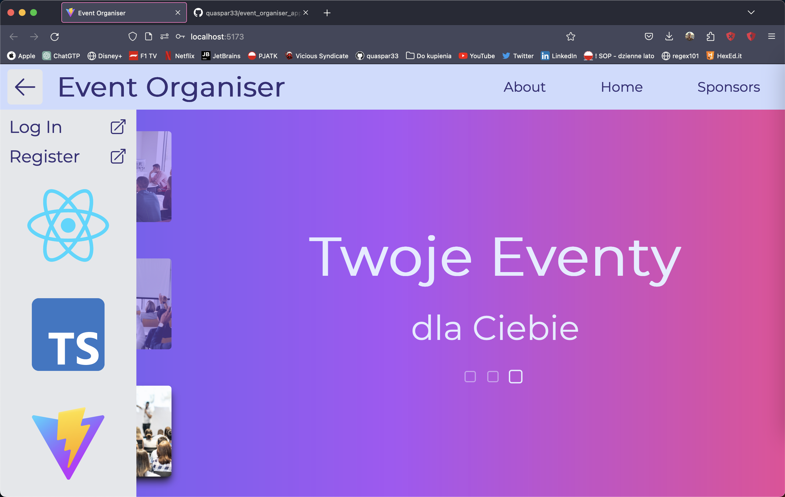
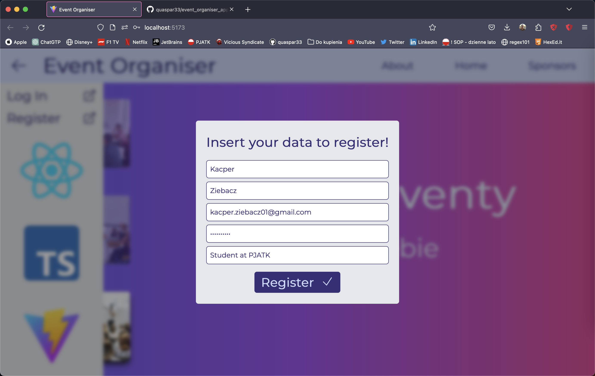

# event-organiser-application
<<<<<<< HEAD
My ownweb application to manage live events
created in Java, TypeScript, TailwindCSS 
to learn modern tools like Maven, Spring-Boot, React, Vite

# screenshots

=======
My own web application with simple user input and
database request created in Java, TypeScript, TailwindCSS 
to learn modern tools like Maven, Spring-Boot, React, Vite

# screenshots

>>>>>>> 00de99a13c1cc35f4bd8572d60203fbfd78f0028
