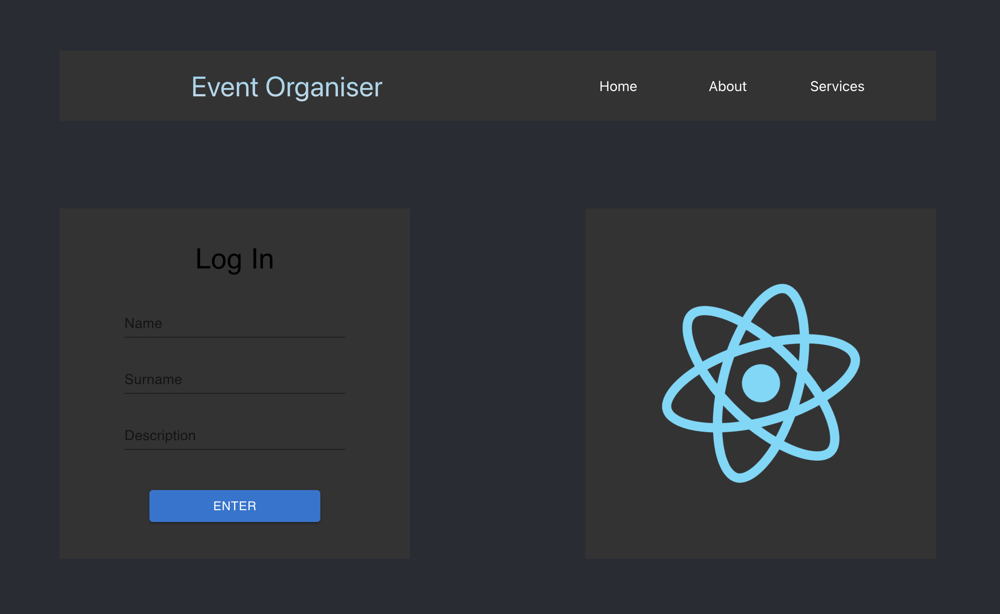
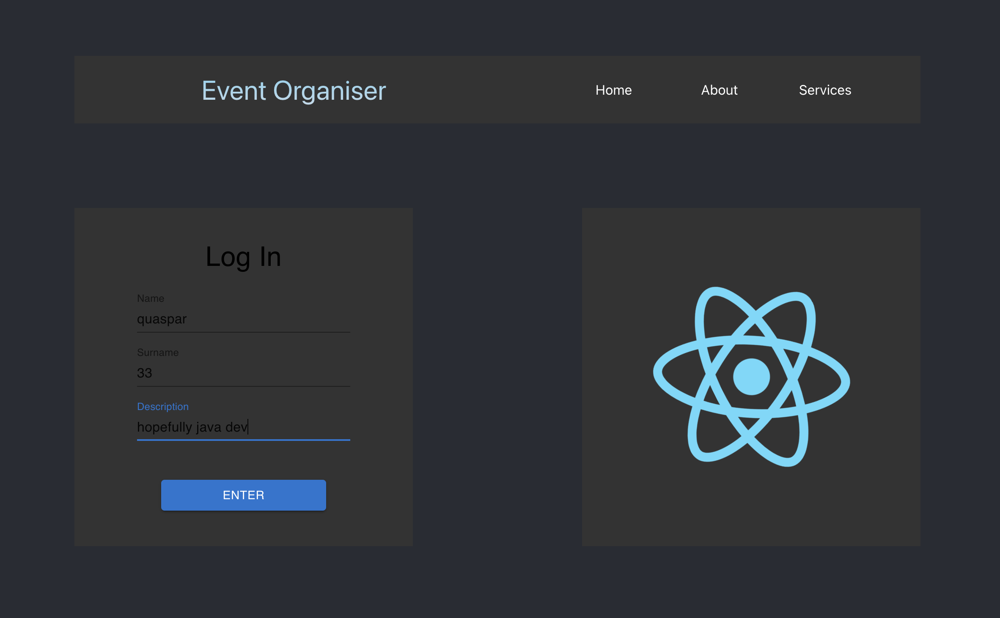

# event-organiser-application
My own web application to manage live events
created in Java, Java-Script, HTML and CSS maily 
to learn modern tools like Maven, Spring-Boot, React etc.

# screenshots

